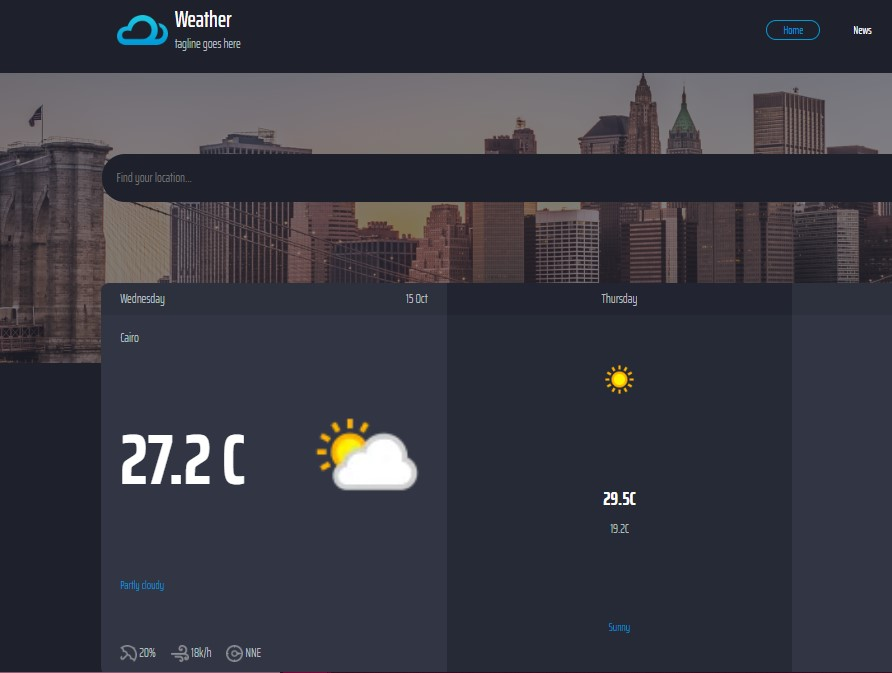

# 🌦️ Real-Time Weather App

A sleek and responsive **Weather Application** built using **HTML**, **CSS**, and **JavaScript**, that fetches real-time weather data from a public **Weather API**.  
Users can search for any city and instantly view live temperature, humidity, wind speed, and weather conditions 🌍.

---

## ✨ Features

- 🔍 **Real-time search** — instantly fetches weather data as you type  
- 🌡️ Displays **temperature, humidity, and wind speed**  
- ☁️ Fetches live weather information using a **Weather API**  
- 💻 Built with **pure JavaScript (AJAX / Fetch API)**  
- 🎨 Clean, modern, and **fully responsive UI**

---

## 🧠 Technologies Used

| Technology | Purpose |
|-------------|----------|
| 💻 **HTML5** | Structure of the application |
| 🎨 **CSS3** | Styling and layout |
| ⚡ **JavaScript (ES6)** | Logic and interactivity |
| 🌐 **OpenWeatherMap API** | Provides real-time weather data |

---

## 🧩 How It Works

1. The user types a **city name** in the search bar 🏙️  
2. An **AJAX / Fetch** call is made to the [OpenWeatherMap API]
3. The app dynamically updates the weather information without reloading the page  

---

## 🚀 Live Demo
🔗 [View Website](https://weather-zeta-jade-74.vercel.app/)  


## 📸 Preview


---


## 🚀 Getting Started

```bash

 1️⃣ Clone the repository
     git clone https://github.com/YourU

 2️⃣ Navigate into the folder
     cd weather-app

 3️⃣ Open index.html
     Simply open it in your browser — no server setup required.


